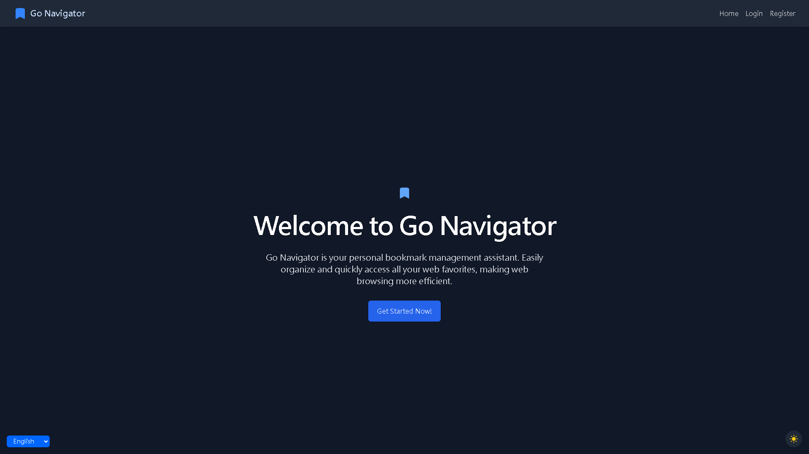

# GoNav

[English](README.md) | [繁體中文](README.zh-TW.md) | [简体中文](README.zh-CN.md)

GoNav is a full-stack bookmark management system with a Go backend and Vue.js frontend.

## Features

- Modern bookmark management
- Responsive UI design
- Multi-language support
- Light/Dark mode
- Public bookmark sharing
- Access code restriction for public sharing

## Project Structure

- `frontend/`: Vue.js frontend application
- `backend/`: Go backend application

## Getting Started

For detailed instructions on setting up and running each part of the project, please refer to:

- [Frontend README](frontend/README.md)
- [Backend README](backend/README.md)

## Screen Shots

## Contributing

Contributions are welcome! Please feel free to submit a Pull Request.

## License

This project is licensed under the MIT License - see the [LICENSE](LICENSE) file for details.
