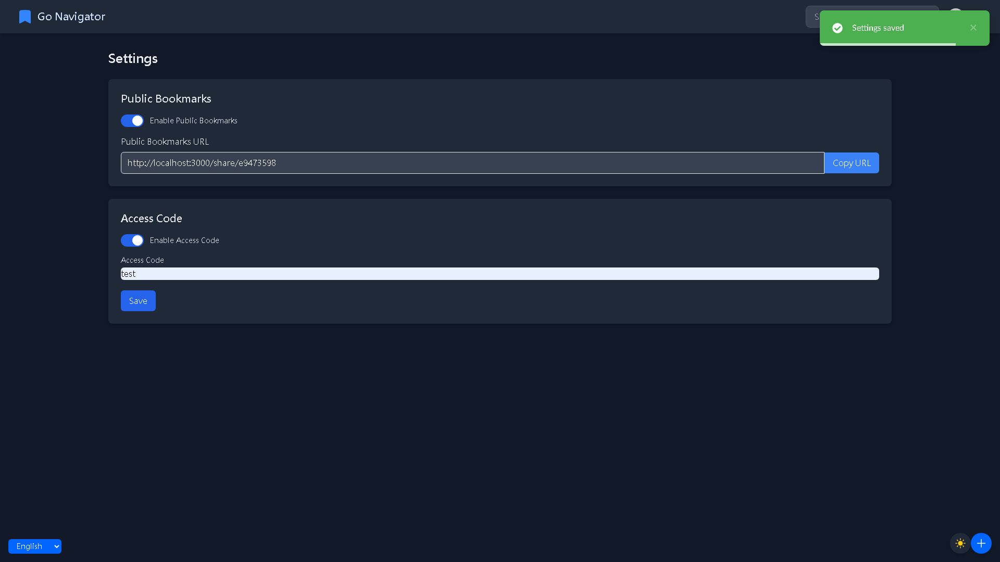
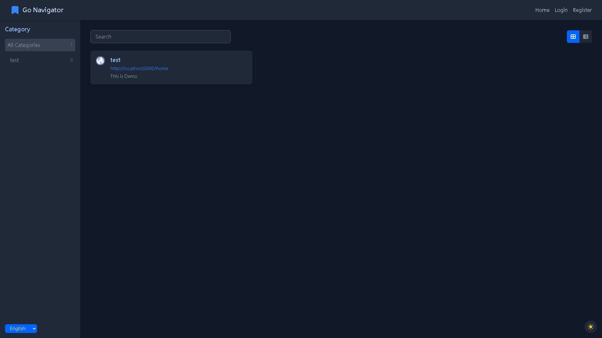

# GoNav

[English](README.md) | [繁體中文](README.zh-TW.md) | [简体中文](README.zh-CN.md)

GoNav 是一个全栈书签管理系统，后端使用 Go 语言开发，前端使用 Vue.js。

## 功能特点

- 现代化的书签管理
- 响应式的UI设计
- 多语言支持
- 明亮/深色模式
- 支持公开书签分享
- 访问码限制公开分享

## 项目结构

- `frontend/`: Vue.js 前端应用
- `backend/`: Go 后端应用

## 快速开始

有关设置和运行项目各部分的详细说明，请参阅：

- [前端 README](frontend/README.zh-CN.md)
- [后端 README](backend/README.zh-CN.md)

## 屏幕截图

## 贡献

欢迎贡献！请随时提交 Pull Request。

## 授权

本项目采用 MIT 授权许可 - 详情请见 [LICENSE](LICENSE) 文件。