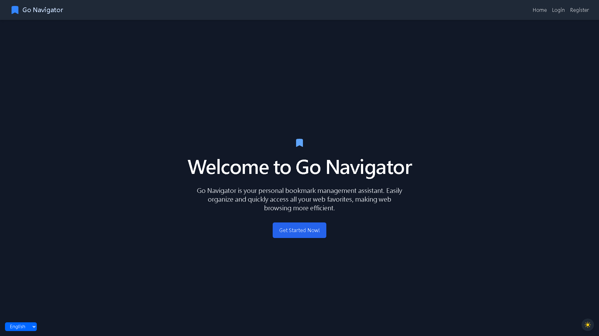
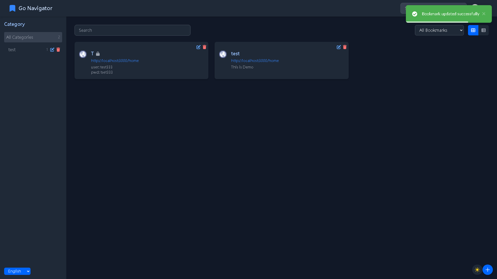
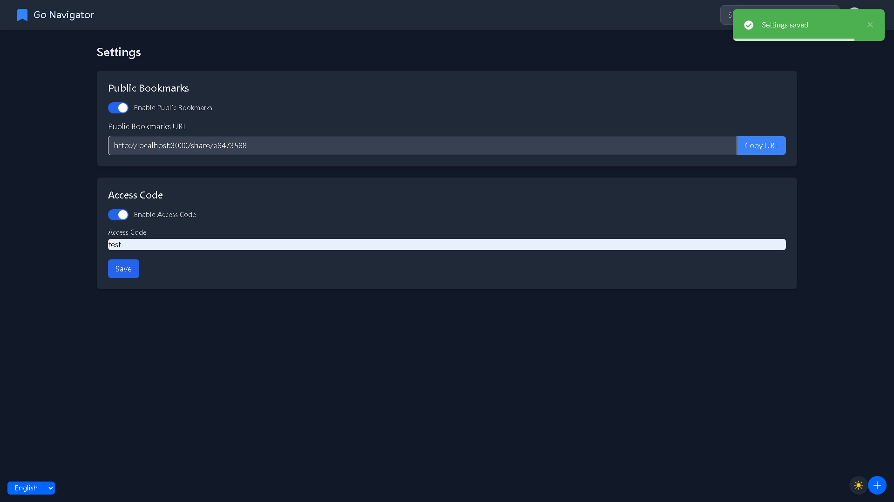
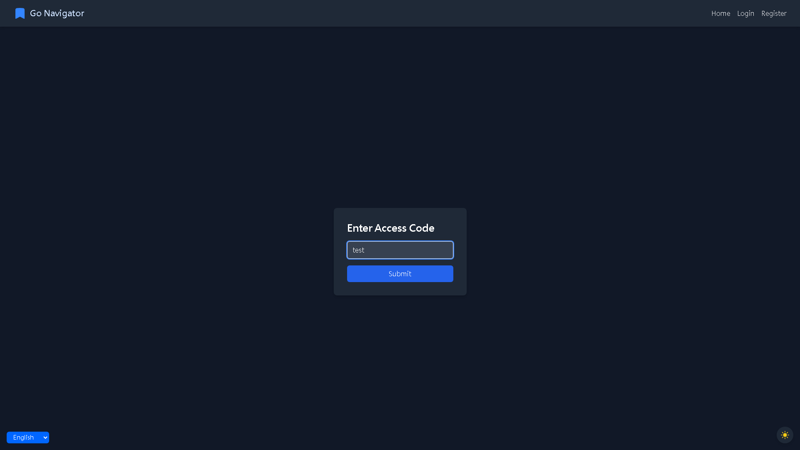
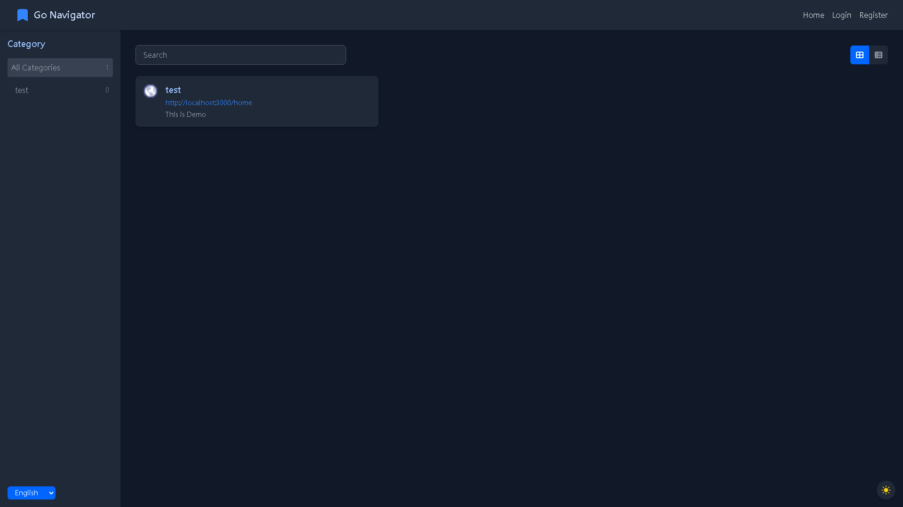

# GoNav

[English](README.md) | [繁體中文](README.zh-TW.md) | [简体中文](README.zh-CN.md)

GoNav 是一個全端的書籤管理系統，後端使用 Go 語言開發，前端使用 Vue.js。

## 功能特點

- 現代化的書籤管理
- 響應式的UI設計
- 多語系支援
- 明亮/深色模式
- 支援公開書籤分享
- 存取碼限制公開分享

## 專案結構

- `frontend/`: Vue.js 前端應用
- `backend/`: Go 後端應用

## 快速開始

有關設置和運行專案各部分的詳細說明，請參閱：

- [前端 README](frontend/README.zh-TW.md)
- [後端 README](backend/README.zh-TW.md)

## 螢幕截圖

## 貢獻

歡迎貢獻！請隨時提交 Pull Request。

## 授權

本專案採用 MIT 授權許可 - 詳情請見 [LICENSE](LICENSE) 文件。
